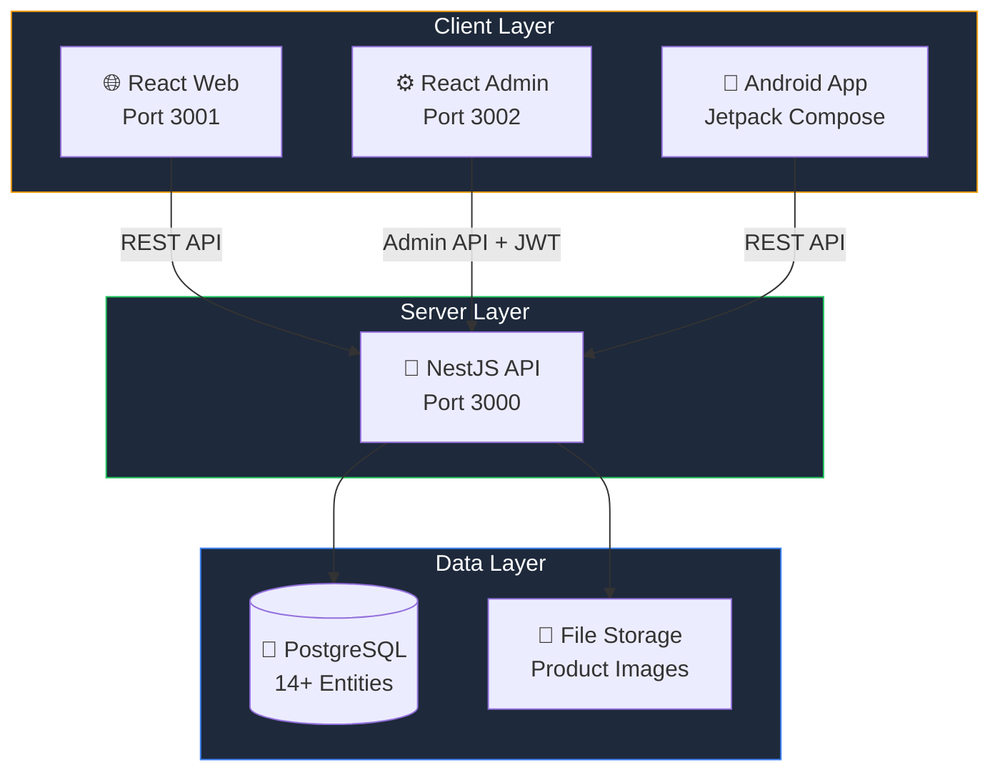
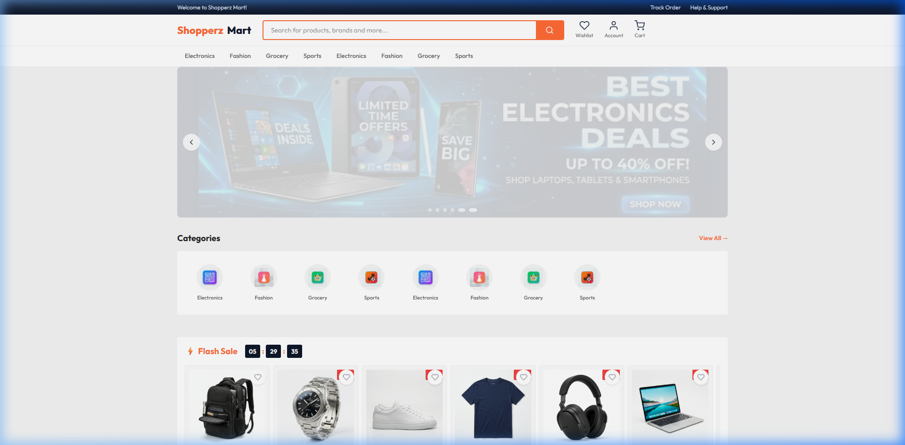
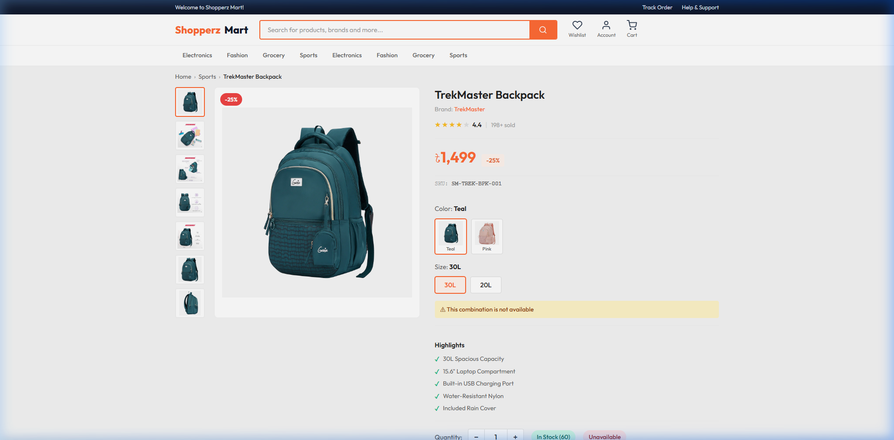
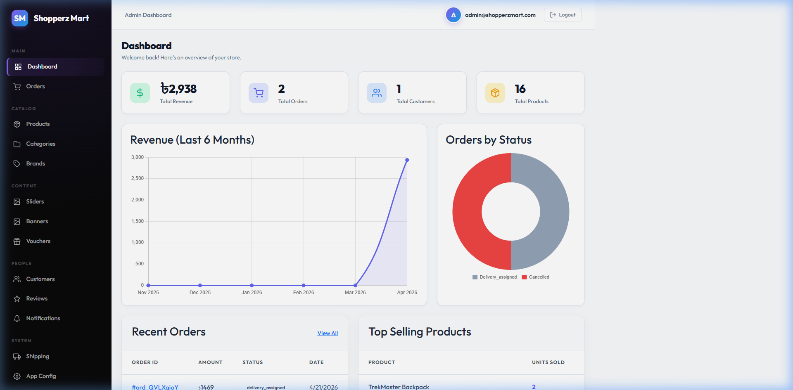
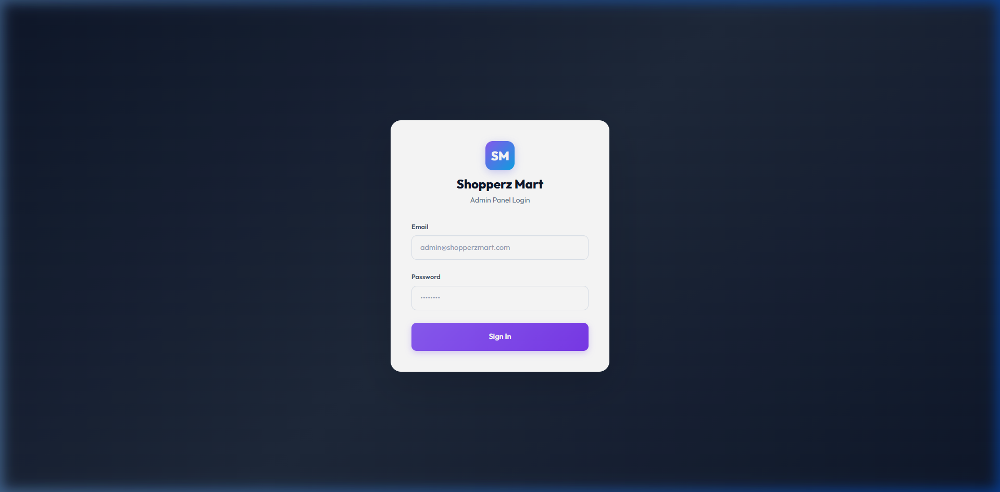

<p align="center">
  
</p>

<h1 align="center">🛒 Shopperz Mart</h1>

<p align="center">
  <strong>A production-ready, full-stack e-commerce platform with Android app, React storefront, Admin panel, and NestJS API — all in one monorepo.</strong>
</p>

<p align="center">
  <a href="https://github.com/IstiyakV/Shopperz-Mart/stargazers"></a>
  <a href="https://github.com/IstiyakV/Shopperz-Mart/network/members"></a>
  <a href="https://github.com/IstiyakV/Shopperz-Mart/issues"></a>
  <a href="LICENSE"></a>
  <a href="https://demoshop.isty.me"></a>
</p>

<p align="center">
  <a href="https://demoshop.isty.me">🌐 Live Demo</a> •
  <a href="#-quick-start">⚡ Quick Start</a> •
  <a href="#-features">✨ Features</a> •
  <a href="#-tech-stack">🛠️ Tech Stack</a> •
  <a href="#-screenshots">📸 Screenshots</a> •
  <a href="CONTRIBUTING.md">🤝 Contributing</a>
</p>

---

## 🎯 What is Shopperz Mart?

Shopperz Mart is a **complete, production-grade e-commerce ecosystem** built from the ground up. It's not a tutorial project — it's a fully deployable platform with real-world features like multi-variant SKU management, Stripe-ready checkout, order tracking, and a native Android app.

**Built for developers who want to:**
- 🏗️ Study a real full-stack architecture (not a TODO app)
- 🚀 Fork and customize for their own e-commerce business
- 📱 See how web and mobile apps share the same API
- 🐳 Deploy anywhere with Docker in under 5 minutes

> **🔗 Live Demo:** [demoshop.isty.me](https://demoshop.isty.me) · Admin Panel: [admin-demoshop.isty.me](https://admin-demoshop.isty.me) (admin@shopperzmart.com / admin123)

---

## ⚡ Quick Start

Get everything running in **under 60 seconds** with Docker:

```bash
# Clone the repository
git clone https://github.com/IstiyakV/Shopperz-Mart.git
cd Shopperz-Mart

# Copy environment config
cp .env.example .env

# Start all services (PostgreSQL + API + Web + Admin)
docker-compose up --build -d

# 🎉 Done! Open in your browser:
# Web:   http://localhost:3001
# Admin: http://localhost:3002 (admin@shopperzmart.com / admin123)
# API:   http://localhost:3000
```

**Prefer local development with hot-reload?**

```bash
# Windows (PowerShell)
.\dev.ps1

# Linux / macOS
chmod +x dev.sh && ./dev.sh
```

This starts PostgreSQL in Docker (~50MB RAM) and runs NestJS + React with hot-reload natively.

---

## ✨ Features

### 🌐 Web Storefront (React)
| Feature | Description |
|:--------|:------------|
| **Hero Carousel** | Auto-playing banner slider with admin-managed content |
| **Product Catalog** | Category filters, price range, sort options, pagination |
| **SKU Variant System** | Amazon-style color/size selectors with per-variant pricing |
| **Flash Sales** | Countdown timer with discounted products |
| **Shopping Cart** | Persistent cart with quantity management |
| **Multi-Step Checkout** | Address → Shipping → Payment → Review wizard |
| **Order Tracking** | 10-stage delivery pipeline with visual timeline |
| **User Accounts** | Profile, addresses, order history, wishlists |
| **SEO Optimized** | Dynamic meta tags, semantic HTML, SEO-friendly URLs |

### 📱 Android App (Kotlin + Jetpack Compose)
| Feature | Description |
|:--------|:------------|
| **Material 3 Design** | Modern, premium UI with Jetpack Compose |
| **Full-Screen Gallery** | Pinch-to-zoom product images with page indicators |
| **Variant Selectors** | Image cards for colors, pills for sizes — live price/stock updates |
| **Smart Cart** | Variant-specific thumbnails, stock guards, animated toast |
| **4-Step Checkout** | Address with 64+ BD cities, shipping zones, order notes |
| **Order Management** | Daraz-inspired tracking with horizontal stepper |
| **Shimmer Loading** | Professional skeleton screens on all data-loading views |
| **Offline Wishlist** | Room database-backed local wishlist |

### 🔧 Admin Panel (React)
| Feature | Description |
|:--------|:------------|
| **Dashboard** | Revenue charts, order stats, top products, recent orders |
| **Product Management** | Full CRUD with image upload and variant matrix |
| **SKU Matrix** | Auto-generated Cartesian combinations with per-SKU pricing |
| **Order Pipeline** | 10-stage status updates with custom timeline entries |
| **Shipping Zones** | Zone-based fee calculation (Dhaka/Outside Dhaka) |
| **16 Admin Pages** | Products, Categories, Brands, Sliders, Banners, Vouchers, Reviews, Customers, Notifications, Shipping, Settings, Payment Gateways |

### 🔌 Backend API (NestJS)
| Feature | Description |
|:--------|:------------|
| **55+ Endpoints** | REST API covering all customer and admin operations |
| **14+ Entities** | Products, Orders, Customers, Variants, Reviews, Cities, Zones... |
| **Auth System** | JWT + Google Sign-In ready (with token validation) |
| **Stripe Integration** | Payment intent creation (mock mode — production-ready code included) |
| **Image Management** | Multer upload with order-asset preservation |
| **Seed Data** | 8 products, 64+ cities, shipping zones, vouchers — works out of the box |

---

## 🛠️ Tech Stack

<table>
<tr>
<td align="center" width="25%">

**Backend**


</td>
<td align="center" width="25%">

**Web Frontend**


</td>
<td align="center" width="25%">

**Android**


</td>
<td align="center" width="25%">

**DevOps**


</td>
</tr>
</table>

---

## 🏗️ Architecture



---

## 📁 Project Structure

```
Shopperz-Mart/
├── Backend/                    # NestJS API Server
│   ├── src/
│   │   ├── modules/            # auth, product, order, admin, home, config
│   │   ├── database/           # TypeORM entities + seed data
│   │   └── main.ts             # Entry point
│   ├── public/images/          # Seed product/banner/category images
│   └── Dockerfile
│
├── Frontend/                   # React Web Storefront
│   ├── src/
│   │   ├── components/         # Header, Footer, ProductCard, HeroCarousel...
│   │   ├── pages/              # Home, ProductList, ProductDetail, Cart, Checkout
│   │   ├── context/            # AuthContext, CartContext, WishlistContext
│   │   └── index.css           # 2100+ line Daraz-inspired design system
│   ├── nginx.conf
│   └── Dockerfile
│
├── Admin/                      # React Admin Panel
│   ├── src/
│   │   ├── components/         # CrudPage, ImageUpload, AdminLayout
│   │   ├── pages/              # Dashboard, Products, Orders, Shipping...
│   │   └── index.css           # Premium glassmorphism design system
│   ├── nginx.conf
│   └── Dockerfile
│
├── Android-Kotlin/             # Native Android App
│   └── app/src/main/java/
│       ├── core/               # Network, DI, Utils
│       ├── data/               # DTOs, Mappers, Repositories
│       ├── domain/             # Models, UseCases
│       └── ui/                 # Compose Screens (20+)
│
├── docker-compose.yml          # Full production stack (4 containers)
├── docker-compose.dev.yml      # Hybrid dev mode (DB in Docker only)
├── dev.ps1 / dev.sh / dev.bat  # One-command dev environment
├── deploy.ps1                  # Production deployment builder
└── .env.example                # Environment configuration template
```

---

## 📸 Screenshots

<details>
<summary><strong>🌐 Web Storefront</strong> (click to expand)</summary>
<br/>

| Homepage | Product Detail |
|:--------:|:--------------:|
|  |  |

</details>

<details>
<summary><strong>⚙️ Admin Panel</strong> (click to expand)</summary>
<br/>

| Dashboard | Login |
|:---------:|:-----:|
|  |  |

</details>

---

## 🚀 Deployment

### Docker (Recommended)

```bash
# Production build
docker-compose up --build -d

# Fresh database (drops existing data)
docker-compose down -v && docker-compose up --build -d
```

### Hybrid Development (Hot-Reload)

Best for active development — runs only PostgreSQL in Docker, everything else locally with hot-reload:

```bash
# Windows
.\dev.ps1

# Linux/macOS
./dev.sh

# Flags:
#   -SkipDb / --skip-db         Skip DB container startup
#   -BackendOnly / --backend-only   Start only NestJS
#   -FrontendOnly / --frontend-only Start only React
```

### Shared Hosting (cPanel/Namecheap)

```bash
# Build all apps into a single deployment ZIP
.\deploy.ps1 -ApiDomain "https://api.yourdomain.com" `
             -WebDomain "https://yourdomain.com" `
             -AdminDomain "https://admin.yourdomain.com"
```

See [Backend/README.md](Backend/README.md) for detailed deployment documentation.

---

## 📱 Android Setup

1. Open `Android-Kotlin/` in Android Studio
2. Create `local.properties` with your SDK path:
   ```properties
   sdk.dir=C\:\\Users\\YourUser\\AppData\\Local\\Android\\Sdk
   ```
3. Update `BASE_URL` in `app/build.gradle.kts` (dev flavor) to your API server
4. Build and run the `devDebug` variant

> **Emulator tip:** The dev flavor uses `http://10.0.2.2:3000/` which maps to your host's localhost via Android emulator.

---

## ⚙️ Environment Variables

Copy `.env.example` to `.env` and configure:

```env
# Database
DATABASE_HOST=db          # 'db' for Docker, 'localhost' for local
DATABASE_PORT=5432
DATABASE_USER=postgres
DATABASE_PASSWORD=your_secure_password
DATABASE_NAME=ecommerce

# Server Ports
API_PORT=3000
WEB_PORT=3001
ADMIN_PORT=3002
DEV_DB_PORT=5433          # Host port for DB (avoids local PG conflict)

# Admin Authentication
ADMIN_EMAIL=admin@shopperzmart.com
ADMIN_PASSWORD=change_this_password
ADMIN_JWT_SECRET=generate_a_random_secret
```

---

## 🤝 Contributing

Contributions are welcome! Please read our [Contributing Guide](CONTRIBUTING.md) for details on:

- Setting up the development environment
- Branch naming conventions
- Commit message format
- Pull request process

```bash
# Fork → Clone → Branch → Code → PR
git checkout -b feature/amazing-feature
git commit -m "feat: add amazing feature"
git push origin feature/amazing-feature
```

---

## 📄 License

This project is licensed under the **MIT License** — see the [LICENSE](LICENSE) file for details.

You are free to use this project for personal or commercial purposes.

---

## ⭐ Show Your Support

If this project helped you learn something new or saved you development time, please consider giving it a **star**! It motivates us to keep building and maintaining this project.

<p align="center">
  <a href="https://github.com/IstiyakV/Shopperz-Mart/stargazers">
    
  </a>
</p>

<p align="center">
  Made with ❤️ by <a href="https://github.com/IstiyakV">Istiyak</a>
</p>
